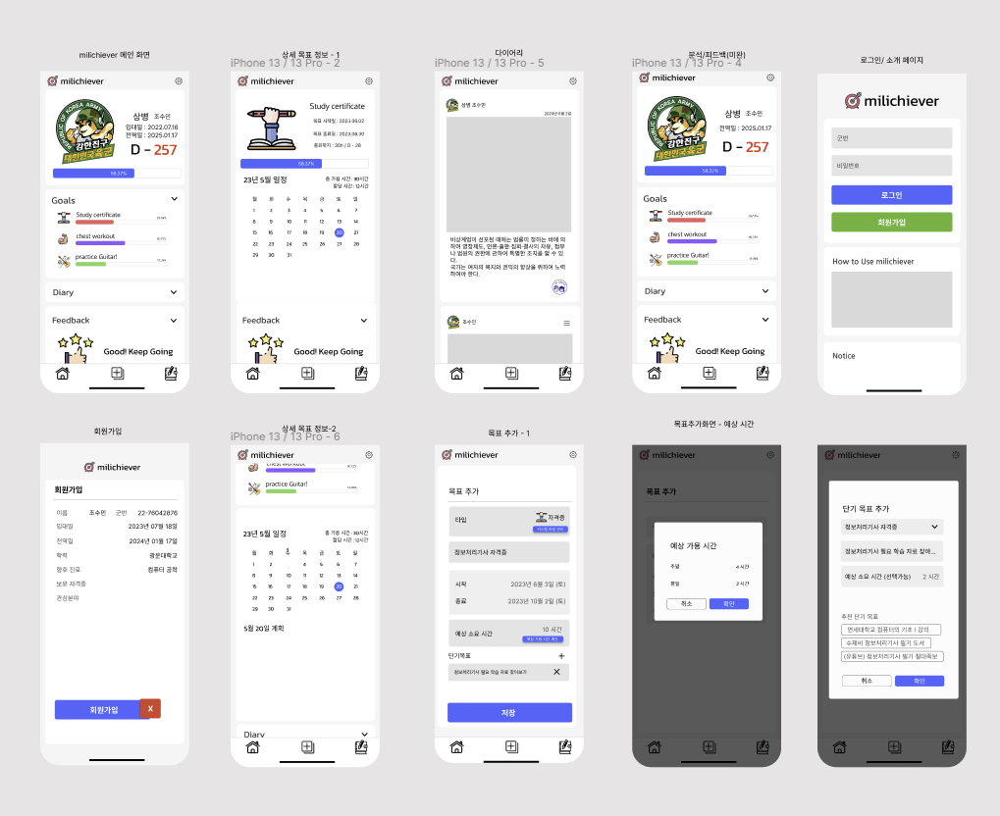

# milchiever
To give background, all Korean male citizens are required to serve in the military for 18 months. Mobile web app that helps conscripted soldiers in ROK Military to set personal goals and receive feedbacks on the progress so that the time is not wasted lavishly and have a smooth transition after discharge.

